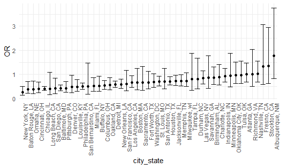

Homework 6
================
Cong Zhang
2020-12-08

This is my solution to Homework 6.

## Problem 1

``` r
homicide_df = 
  read_csv("data/homicide-data.csv", na = c("", "NA", "Unknown")) %>% 
  mutate(
    city_state = str_c(city, state, sep = ", "),
    victim_age = as.numeric(victim_age),
    resolution = case_when(
      disposition == "Closed without arrest" ~ 0,
      disposition == "Open/No arrest"        ~ 0,
      disposition == "Closed by arrest"      ~ 1)
  ) %>% 
  filter(
    victim_race %in% c("White", "Black"),
    city_state != "Tulsa, AL") %>% 
  select(city_state, resolution, victim_age, victim_race, victim_sex)
```

Start with one city.

``` r
baltimore_df =
  homicide_df %>% 
  filter(city_state == "Baltimore, MD")

glm(resolution ~ victim_age + victim_race + victim_sex, 
    data = baltimore_df,
    family = binomial()) %>% 
  broom::tidy() %>% 
  mutate(
    OR = exp(estimate),
    CI_lower = exp(estimate - 1.96 * std.error),
    CI_upper = exp(estimate + 1.96 * std.error)
  ) %>% 
  select(term, OR, starts_with("CI")) %>% 
  knitr::kable(digits = 3)
```

| term              |    OR | CI\_lower | CI\_upper |
| :---------------- | ----: | --------: | --------: |
| (Intercept)       | 1.363 |     0.975 |     1.907 |
| victim\_age       | 0.993 |     0.987 |     1.000 |
| victim\_raceWhite | 2.320 |     1.648 |     3.268 |
| victim\_sexMale   | 0.426 |     0.325 |     0.558 |

Try this across cities.

``` r
models_results_df = 
  homicide_df %>% 
  nest(data = -city_state) %>% 
  mutate(
    models = 
      map(.x = data, ~glm(resolution ~ victim_age + victim_race + victim_sex, data = .x, family = binomial())),
    results = map(models, broom::tidy)
  ) %>% 
  select(city_state, results) %>% 
  unnest(results) %>% 
  mutate(
    OR = exp(estimate),
    CI_lower = exp(estimate - 1.96 * std.error),
    CI_upper = exp(estimate + 1.96 * std.error)
  ) %>% 
  select(city_state, term, OR, starts_with("CI")) 
```

``` r
models_results_df %>% 
  filter(term == "victim_sexMale") %>% 
  mutate(city_state = fct_reorder(city_state, OR)) %>% 
  ggplot(aes(x = city_state, y = OR)) + 
  geom_point() + 
  geom_errorbar(aes(ymin = CI_lower, ymax = CI_upper)) + 
  theme(axis.text.x = element_text(angle = 90, hjust = 1))
```



## Problem 2

#### Load and clean the data for regression analysis.

``` r
baby_df = 
  read_csv("./data/birthweight.csv") %>% 
  janitor::clean_names() %>% 
  mutate(
    babysex = factor(babysex),
    babysex = fct_recode(babysex, male = "1", female = "2"),
    frace = factor(frace),
    frace = fct_recode(frace, white = "1", black = "2", asian = "3", puerto_rican = "4", other = "8"),
    malform = factor(malform),
    malform = fct_recode(malform, absent = "0", present = "1"),
    mrace = factor(mrace),
    mrace = fct_recode(mrace, white = "1", black = "2", asian = "3", puerto_rican = "4"),
    delwt = delwt * 453.59237,
    ppwt = ppwt * 453.59237,
    wtgain = wtgain * 453.59237
  )

sum(is.na(baby_df))
```

    ## [1] 0

The resulting dataset `baby_df` contains the following 20 variables:
babysex, bhead, blength, bwt, delwt, fincome, frace, gaweeks, malform,
menarche, mheight, momage, mrace, parity, pnumlbw, pnumsga, ppbmi, ppwt,
smoken, wtgain. This dataset has 4342 observations and 0 missing value.
Numeric variables `babysex`, `frace`, `malform`, and `mrace` have been
converted into factor variables. Some weight variables have the units of
pounds, and other weight variables have the units of grams. Therefore,
the units of variables `delwt`, `ppwt` and `wtgain` have been converted
from pounds to grams for further analyses.

#### Propose a regression model for birthweight.

``` r
step_mod = step(lm(bwt ~., data = baby_df), direction = 'both', trace = FALSE)

summary(step_mod)
```

    ## 
    ## Call:
    ## lm(formula = bwt ~ babysex + bhead + blength + delwt + fincome + 
    ##     gaweeks + mheight + mrace + parity + ppwt + smoken, data = baby_df)
    ## 
    ## Residuals:
    ##      Min       1Q   Median       3Q      Max 
    ## -1097.18  -185.52    -3.39   174.14  2353.44 
    ## 
    ## Coefficients:
    ##                     Estimate Std. Error t value Pr(>|t|)    
    ## (Intercept)       -6.099e+03  1.375e+02 -44.340  < 2e-16 ***
    ## babysexfemale      2.856e+01  8.455e+00   3.378 0.000737 ***
    ## bhead              1.308e+02  3.447e+00  37.944  < 2e-16 ***
    ## blength            7.495e+01  2.019e+00  37.120  < 2e-16 ***
    ## delwt              9.054e-03  8.643e-04  10.475  < 2e-16 ***
    ## fincome            3.180e-01  1.747e-01   1.820 0.068844 .  
    ## gaweeks            1.159e+01  1.462e+00   7.929 2.79e-15 ***
    ## mheight            6.594e+00  1.785e+00   3.694 0.000223 ***
    ## mraceblack        -1.388e+02  9.907e+00 -14.009  < 2e-16 ***
    ## mraceasian        -7.489e+01  4.231e+01  -1.770 0.076837 .  
    ## mracepuerto_rican -1.007e+02  1.932e+01  -5.210 1.98e-07 ***
    ## parity             9.630e+01  4.034e+01   2.388 0.017004 *  
    ## ppwt              -5.899e-03  9.422e-04  -6.261 4.20e-10 ***
    ## smoken            -4.843e+00  5.856e-01  -8.271  < 2e-16 ***
    ## ---
    ## Signif. codes:  0 '***' 0.001 '**' 0.01 '*' 0.05 '.' 0.1 ' ' 1
    ## 
    ## Residual standard error: 272.3 on 4328 degrees of freedom
    ## Multiple R-squared:  0.7181, Adjusted R-squared:  0.7173 
    ## F-statistic: 848.1 on 13 and 4328 DF,  p-value: < 2.2e-16

Stepwise algorithm, with AIC being the criteria, has been used to find
the suitable regression model for birthweight. Finally, we have the
optimal regression model: `bwt ~ babysex + bhead + blength + delwt +
fincome + gaweeks + mheight + mrace + parity + ppwt + smoken`. The
multiple r-squared is 0.7181, and adjusted r-squared is 0.7173. The p
value is smaller than 2.2e-16.

#### Show a plot of model residuals against fitted values.

``` r
baby_df %>% 
  add_predictions(step_mod) %>% 
  add_residuals(step_mod) %>% 
  ggplot(aes(x = pred, y = resid)) + 
  geom_point(alpha = 0.3) +
  geom_smooth(method = "lm", color = "red", se = FALSE) +
  labs(title = "Fitted Values vs. Model Residuals",
       x = "Fitted Values", 
       y = "Model Residuals",
       caption = "Data from Child’s Birthweight Dataset")
```

    ## `geom_smooth()` using formula 'y ~ x'


From the graph, we could see a big cluster of points. In the right side
where fitted values are large, the model residuals tend to evenly
distributed around 0. In the left side where fitted values are small,
most model residuals are positive and some some model residuals a far
greater than 0.

#### Compare my model to two others.

``` r
cv_df = 
  crossv_mc(baby_df, 100) %>% 
  mutate(
    train = map(train, as_tibble),
    test = map(test, as_tibble)
  ) %>% 
  mutate(
    model_1 = map(.x = train, ~lm(bwt ~ blength + gaweeks, data = .x)),
    model_2 = map(.x = train, ~lm(bwt ~ bhead * blength * babysex, data = .x)),
    model_step = map(.x = train, ~lm(bwt ~ babysex + bhead + blength + delwt + fincome + gaweeks + mheight + mrace + parity + ppwt + smoken, data = .x))
  ) %>% 
  mutate(
    rmse_model_1 = map2_dbl(.x = model_1, .y = test, ~rmse(model = .x, data = .y)),
    rmse_model_2 = map2_dbl(.x = model_2, .y = test, ~rmse(model = .x, data = .y)),
    rmse_model_step = map2_dbl(.x = model_step, .y = test, ~rmse(model = .x, data = .y))
  )


cv_df %>% 
  select(starts_with("rmse")) %>% 
  pivot_longer(
    everything(),
    names_to = "model",
    values_to = "rmse",
    names_prefix = "rmse_"
  ) %>% 
  mutate(model = fct_reorder(model,rmse)) %>%   
  ggplot(aes(x = model, y = rmse, fill = model)) +
  geom_violin() +
  labs(title = "Cross Validation Comparisons",
       x = "Model",
       y = "RMSE",
       caption = "Data from Child’s Birthweight Dataset")
```


From the violin plot, we could see that my model `rmse_model_step` (bwt
\~ babysex + bhead + blength + delwt + fincome + gaweeks + mheight +
mrace + parity + ppwt + smoken) has lower RMSE than the other two
models: `model_1` (bwt \~ blength + gaweeks) and `model_2` (bwt \~ bhead
\* blength \* babysex). Therefore, `rmse_model_step` has the best
performance among these three models, and `model_1` with main effect
only has the worst performance among all three models.

## Problem 3

#### Load and clean the data for regression analysis.

``` r
weather_df = 
  rnoaa::meteo_pull_monitors(
    c("USW00094728"),
    var = c("PRCP", "TMIN", "TMAX"), 
    date_min = "2017-01-01",
    date_max = "2017-12-31") %>%
  mutate(
    name = recode(id, USW00094728 = "CentralPark_NY"),
    tmin = tmin / 10,
    tmax = tmax / 10) %>%
  select(name, id, everything())
```

#### Use 5000 bootstrap samples and, for each bootstrap sample, produce estimates of these two quantities.

``` r
boot_results = 
  weather_df %>% 
  bootstrap(5000, id = "strap_number") %>% 
  mutate(
    models = map(.x = strap, ~lm(tmax ~ tmin, data = .x)), 
    results_tidy = map(models, broom::tidy),
    results_glance = map(models, broom::glance)
  ) %>% 
  select(-strap, -models) %>% 
  unnest(results_tidy, results_glance) %>% 
  select(strap_number, term, estimate, r.squared) %>%  
  pivot_wider(
    names_from = term,
    values_from = estimate) %>% 
  rename(
    beta0 = "(Intercept)",
    beta1 = "tmin") %>% 
  mutate(log_beta = log(beta0 * beta1)) %>% 
  select(strap_number, r.squared, log_beta)

head(boot_results)
```

    ## # A tibble: 6 x 3
    ##   strap_number r.squared log_beta
    ##   <chr>            <dbl>    <dbl>
    ## 1 0001             0.898     2.04
    ## 2 0002             0.913     1.99
    ## 3 0003             0.902     2.04
    ## 4 0004             0.904     2.01
    ## 5 0005             0.920     1.99
    ## 6 0006             0.904     2.02

#### Plot the distribution of the estimates, and describe these in words.

``` r
boot_results %>% 
  ggplot(aes(x = r.squared)) +
  geom_density(alpha = 0.5, fill = "red") + 
  labs(
    title = "Distribution of R-squared",
    x = "R-squared",
    y = "Density",
    caption = "Results from 5000 Bootstrap Samples"
 )
```


``` r
boot_results %>% 
  ggplot(aes(x = log_beta)) +
  geom_density(alpha = 0.5, fill = "blue") + 
  labs(
    title = "Distribution of Log(beta0 * beta1)",
    x = "Log(beta0 * beta1)",
    y = "Density",
    caption = "Results from 5000 Bootstrap Samples"
 )
```


From the graphs, we could see that r-squared is approximately normally
distributed. However, the distribution of r-squared is a little skewed
and there is a short left tail. The distribution of Log(beta0 \* beta1)
is approximately a normal distribution.

#### Using the 5000 bootstrap estimates, identify the 2.5% and 97.5% quantiles to provide a 95% confidence interval.

``` r
ci =
  boot_results %>% 
  summarize(
    ci_lower_r_squared = quantile(r.squared, 0.025),
    ci_upper_r_squared = quantile(r.squared, 0.975),
    ci_lower_log_beta = quantile(log_beta, 0.025),
    ci_upper_log_beta = quantile(log_beta, 0.975))

ci
```

    ## # A tibble: 1 x 4
    ##   ci_lower_r_squared ci_upper_r_squared ci_lower_log_beta ci_upper_log_beta
    ##                <dbl>              <dbl>             <dbl>             <dbl>
    ## 1              0.894              0.927              1.97              2.06

Therefore, the 95% confidence interval for r-squared is (0.8936977,
0.9274807), and the 95% confidence interval for log(beta0 \* beta1) is
(1.9669417, 2.0585284).
